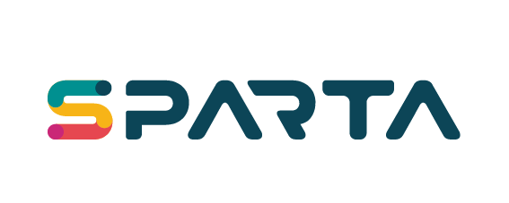

# SPARTA Threat Modeling

**SPARTA** (Security and Privacy Analysis through Risk-driven Threat Assessment) is an open-source tool for security and privacy threat modeling and risk analysis on data flow diagrams (DFDs), developed at [DistriNet, KU Leuven](https://distrinet.cs.kuleuven.be/).

Model your system as a DFD, add the security and privacy solutions (countermeasures) it uses, and SPARTA elicits the threats and calculates their risk. Countermeasures lower the risk of a threat instead of hiding it, so every threat stays visible and traceable.

## Repositories

| Repository | What it holds |
| --- | --- |
| [SPARTA](https://github.com/SPARTA-Threat-Modeling/SPARTA) | The tool: Eclipse-based application, Eclipse plug-ins, command-line tools and Java libraries |
| [catalogs](https://github.com/SPARTA-Threat-Modeling/catalogs) | Threat catalogs for STRIDE and LINDDUN |
| [example-cases](https://github.com/SPARTA-Threat-Modeling/example-cases) | Example SPARTA models (Contoso, social network, WebRTC) |

## Get started

- **Download** the application for Windows, macOS or Linux from the [latest release](https://github.com/SPARTA-Threat-Modeling/SPARTA/releases/latest)
- **Read** the [documentation](https://docs.sparta.distrinet-research.be/main/index.html)
- **Automate** threat analysis in CI/CD with the `sparta-cli` and `sparta-ci` tools
- **Learn more** on the [website](https://sparta.distrinet-research.be)

SPARTA exports results to CSV, Excel, and LaTeX.

## Contributing

Questions, bug reports and pull requests are welcome; see the [contributing guide](https://github.com/SPARTA-Threat-Modeling/SPARTA/blob/main/CONTRIBUTING.md). Report vulnerabilities privately as described in the [security policy](https://github.com/SPARTA-Threat-Modeling/SPARTA/security/policy).

SPARTA is a research prototype, maintained on a best-effort basis.

## Citing SPARTA

If you use SPARTA in your research, please cite (check the author list and add the DOI):

> L. Sion, D. Van Landuyt, K. Yskout, W. Joosen. *SPARTA: Security & Privacy Architecture through Risk-driven Threat Assessment.* ICSA-C 2018.

More on the [publications page](https://sparta.distrinet-research.be/publications/).

## License and contact

SPARTA is licensed under the [Eclipse Public License 2.0](https://www.eclipse.org/legal/epl-2.0/).
Developed by the SPARTA team at DistriNet, KU Leuven. Contact: sparta@cs.kuleuven.be